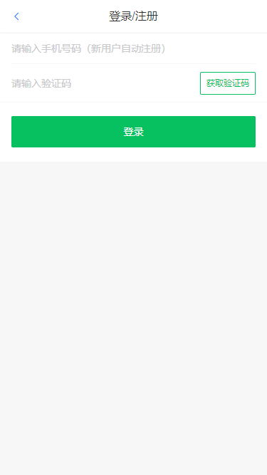
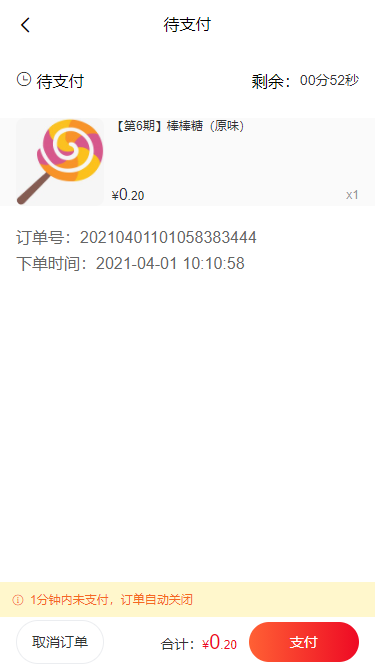
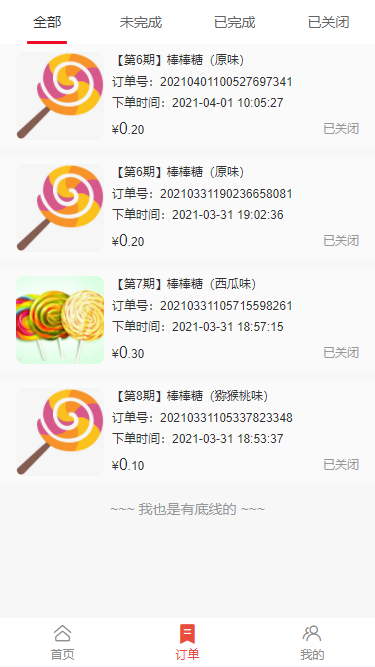
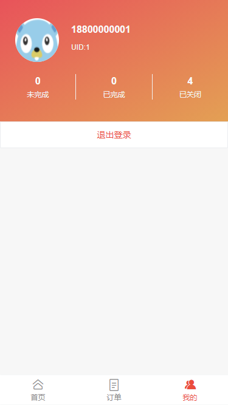
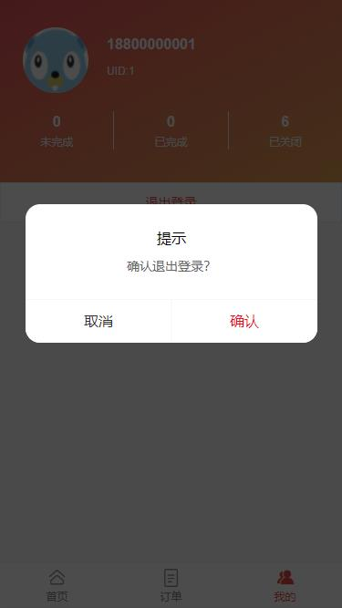

# miaosha

基于 Golang 实现高并发秒杀系统，技术栈：Golang、Gin、Redis、MySQL、NSQ等，包括用户注册登录、分布式 Session、秒杀、异步下单、限流等功能，采用 Jenkins+Docker 部署；项目中还有很多不足，欢迎大家批评指正。

[在线演示](https://mtony.cn/miaosha/)

## 运行

1. 复制 conf.example.ini 配置文件并重命名为 conf.ini
2. 根据需要修改 conf.ini 配置文件
3. 控制台执行 `go run main.go` ，或者 docker 环境下执行 `./deploy.sh` 一键部署

## 功能

## 快照

 

 

 

 

## 致谢

项目编写过程中，以下资料提供过帮助，特此感谢。

 [Java秒杀系统方案优化](https://coding.imooc.com/class/168.html)